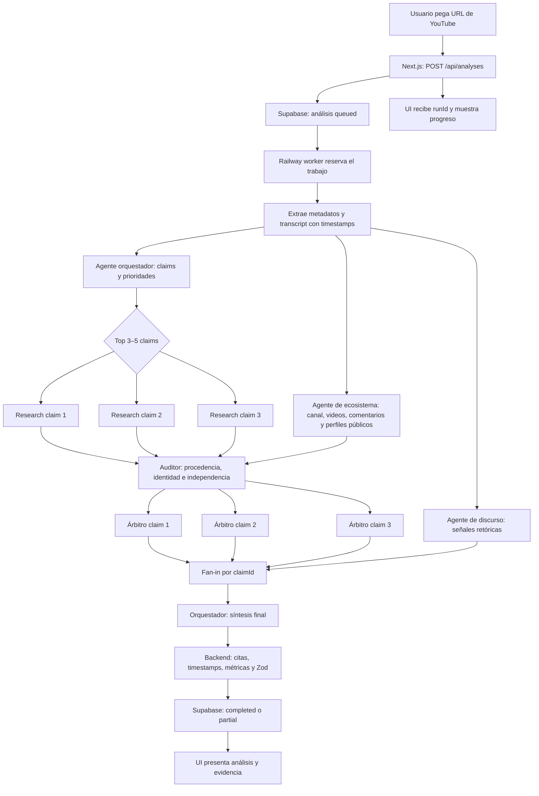

# PRD — Motor de análisis de verdad

**Estado:** Arquitectura y contrato de salida propuestos (v0.3)
**Responsable de producto y motor:** Eduardo
**Proyecto:** Motor de Verdad — OpenAI Build Week
**Rama:** `codex/motor-de-analisis`

## 1. Objetivo

Construir un motor explicable que reciba contenido audiovisual o textual, identifique señales observables de manipulación retórica y falta de sustento, contraste las afirmaciones de mayor impacto con fuentes trazables, investigue el ecosistema público del creador y entregue un JSON consistente que ayude al usuario a decidir qué información merece confianza o verificación adicional.

El producto no afirmará que una persona “miente” ni inferirá intención, personalidad o engaño a partir de gestos, voz, nerviosismo o seguridad. Evaluará el discurso, las afirmaciones y la evidencia disponible.

## 2. Problema del usuario

Las personas consumen videos, artículos y discursos que mezclan hechos, opiniones, promesas, emoción y técnicas de persuasión. Hoy les cuesta responder con rapidez:

- ¿Qué afirmaciones son verificables?
- ¿Qué evidencia respalda o contradice las afirmaciones importantes?
- ¿La fuente citada realmente demuestra lo que se afirma?
- ¿Qué recursos retóricos aumentan la presión o aparentan más certeza de la que permite la evidencia?
- ¿Qué no se pudo comprobar y por qué?

## 3. Promesa de producto

> “Separa la persuasión de los hechos, contrasta las afirmaciones importantes y muestra la evidencia para que tú decidas.”

El sistema mostrará seis dimensiones independientes:

1. **Riesgo factual:** resultado de las claims resueltas.
2. **Manipulación y persuasión:** urgencia, escasez, falsa certeza y otras técnicas observables.
3. **Patrones en la muestra reciente:** repetición de claims o técnicas entre videos.
4. **Transparencia:** fuentes, método, denominador, periodos, términos y conflictos aplicables.
5. **Riesgo público corroborado:** únicamente hechos externos atribuibles y corroborados.
6. **Experiencias de audiencia corroboradas:** separadas del sentimiento bruto de comentarios.

Además se mostrará un promedio ponderado experimental, `globalRisk.observedRiskScore`, siempre acompañado por cobertura y rango de incertidumbre. No es un “índice de verdad” ni reputación de la persona: un contenido puede ser emocional y verdadero, o sobrio y falso.

## 4. Roles del sistema multiagente

### 4.1 Orquestador de ingesta y síntesis

- Recibe texto o transcript ya extraído.
- Valida entrada, idioma, tamaño y consentimiento/procedencia cuando aplique.
- Crea `runId`, presupuesto, límites de tiempo y prioridad de claims.
- Invoca especialistas y conserva el control del flujo.
- Ensambla la respuesta final y la valida con Zod.
- No permite que un agente edite directamente el JSON canónico.

### 4.2 Analista de discurso y argumentación

- Detecta falacias, apelaciones emocionales, vaguedad, falsa precisión, omisiones relevantes y certeza sin respaldo.
- Separa opiniones de afirmaciones verificables.
- Extrae citas y contexto, sin inferir intención psicológica.
- Produce una evaluación retórica estructurada.

### 4.3 Investigador web

- Investiga únicamente las 3–5 afirmaciones verificables de mayor impacto en el MVP.
- Prioriza fuentes primarias, oficiales y metodologías transparentes.
- Registra consultas, fechas, extractos y URLs directas.
- Recupera evidencia a favor, en contra y de contexto; no decide por sí solo el veredicto.

### 4.4 Investigador del ecosistema público del creador

- Resuelve la identidad pública del canal antes de atribuir perfiles o comunidades.
- Revisa una muestra configurable de videos recientes del mismo canal para detectar consistencia, cambios de promesa y claims repetidos.
- Recupera comentarios públicos mediante APIs permitidas y resume temas positivos, negativos y mixtos con método de muestreo visible.
- Busca sitio oficial, perfiles profesionales públicos, empresa, comunidad pública y otros activos enlazados por el propio creador.
- Registra evidencia verificable de existencia, fechas, textos y enlaces; no convierte popularidad o comentarios en prueba de verdad.
- Devuelve `creatorContext` y `audienceSignals`, nunca un “reputationScore” opaco.

### 4.5 Auditor de procedencia e independencia

- Construye el grafo `claim → evidence → origin` antes del arbitraje.
- Agrupa URLs que copian el mismo estudio, comunicado, demanda, comentario o incidente mediante `originClusterId`.
- Detecta afiliados, conflictos de interés, citas circulares y activos controlados por el creador.
- Confirma identidad, autenticidad y estado procesal: denuncia, investigación, medida provisional, sanción o sentencia firme.
- Detecta anomalías de coordinación sin afirmar que una cuenta es un bot cuando no hay prueba.
- Busca deliberadamente contraevidencia y registra fuentes inaccesibles.

### 4.6 Árbitro forense de evidencia

- Comprueba que cada fuente realmente implique el claim evaluado.
- Revisa fecha, geografía, población, unidad, denominador y metodología.
- Busca explicaciones alternativas y evidencia contraria.
- Puede abstenerse cuando la evidencia sea insuficiente o esté en disputa.

Estos seis roles separan descubrimiento, procedencia y juicio. Encontrar una página, perfil o comentario no equivale a verificar una afirmación. El auditor limpia la evidencia; el árbitro decide; el backend calcula el score.

## 5. Tres opciones de arquitectura

### Opción 1 — Pipeline determinista de cuatro agentes

```text
Entrada
  → orquestador
  → análisis retórico + extracción de claims
  → investigación de 3–5 claims prioritarios
  → arbitraje de evidencia
  → ensamblado, métricas y validación Zod
  → JSON final
```

El backend define el orden, los límites y las reglas de fusión. Los especialistas devuelven artefactos internos separados; el orquestador conserva la respuesta final.

**Ventajas**

- Es la opción más rápida de implementar y depurar.
- Mantiene costo y consumo de búsqueda controlados.
- Produce resultados reproducibles y fáciles de explicar en la demo.
- Encaja con el contrato v1 y permite una migración aditiva.

**Desventajas**

- La latencia de las etapas se acumula.
- Un fallo temprano puede degradar las etapas posteriores.
- Investiga menos claims por ejecución.

**Uso recomendado:** alternativa de contingencia si el paralelismo no llega estable a la demo.

### Opción 2 — Fan-out/fan-in paralelo por afirmación

Después de extraer los claims, el sistema abre tareas paralelas de investigación y arbitraje para cada afirmación. Un agregador determinista espera los resultados y los fusiona por identificadores estables.

**Ventajas**

- Reduce la latencia total cuando hay varias afirmaciones.
- Permite presentar progreso por claim en la UI.
- Escala mejor que la ejecución secuencial.

**Desventajas**

- Aumenta costo, concurrencia y riesgo de rate limit.
- Requiere reintentos, deduplicación, merge idempotente y estados parciales.
- Tiene más complejidad para el plazo actual.

**Decisión aprobada:** arquitectura del MVP, con concurrencia máxima inicial de 3 claims.

### Opción 3 — Workflow durable orientado a eventos

Cada etapa es un trabajo persistido: ingesta, análisis, investigación, arbitraje y síntesis. Railway ejecuta workers; Supabase conserva estados, artefactos, reintentos y auditoría.

**Ventajas**

- Máxima recuperación ante fallos y observabilidad.
- Permite caché de evidencia, reanudación y escala independiente.
- Es la base más sólida para producción.

**Desventajas**

- Exige más tablas, workers, colas, políticas de reintento y operación.
- Es excesiva para validar la idea en el hackathon.
- Añade más puntos de fallo antes de demostrar valor al usuario.

**Uso recomendado:** arquitectura objetivo de producción.

## 6. Comparación y decisión recomendada

| Criterio | Opción 1 | Opción 2 | Opción 3 |
| --- | --- | --- | --- |
| Tiempo de implementación | Bajo | Medio | Alto |
| Costo por análisis | Bajo–medio | Medio–alto | Configurable, con mayor costo operativo |
| Latencia | Media | Baja–media | Variable |
| Consistencia | Alta | Media–alta | Alta |
| Recuperación ante fallos | Básica | Media | Alta |
| Adecuación al hackathon | Alta | **Alta con Railway worker** | Baja |
| Escalabilidad futura | Media | Alta | **Muy alta** |

**Decisión de Eduardo:** implementar la **Opción 2**, usando Railway para ejecutar el worker y limitando la concurrencia inicial a 3 claims. La Opción 1 queda como modo de contingencia: el mismo pipeline podrá ejecutarse con concurrencia 1 si aparecen problemas de rate limit, costo o estabilidad.

La documentación oficial del Agents SDK distingue entre “agents as tools”, donde un manager conserva el control y combina especialistas, y handoffs, donde el especialista toma el control. Para este producto conviene el patrón manager/agents-as-tools, complementado por orquestación determinista en código, Structured Outputs y trazas.

### 6.1 Despliegue en Railway y Supabase

El sistema tendrá dos servicios dentro del mismo proyecto de Railway:

1. **`web` — Next.js:** sirve la UI y endpoints cortos. `POST /api/analyses` valida la URL, crea el trabajo y responde inmediatamente con HTTP `202` y un `runId`. No espera a que termine el análisis.
2. **`analysis-worker` — Node.js/TypeScript:** toma trabajos pendientes, extrae el transcript, ejecuta agentes, controla concurrencia, valida resultados y persiste avances.

Supabase será el estado compartido:

- `analyses`: solicitud, estado general, progreso y resultado final.
- `agentRuns`: ejecución por agente, modelo, tiempos, tokens, errores y reintentos.
- `claims`: afirmaciones atómicas, prioridad y estado de investigación.
- `evidence`: fuentes, extractos, postura, fechas y calidad.

Para el MVP, la propia tabla de trabajos de Supabase puede funcionar como cola. El worker reserva trabajos y claims de forma atómica para que dos procesos no analicen lo mismo. Las claves de OpenAI y cualquier credencial de búsqueda existirán solo en el worker, nunca en el navegador.

### 6.2 Cómo se reparten las responsabilidades

La arquitectura tendrá dos niveles de orquestación:

- **Orquestador técnico en código:** una máquina de estados dentro del worker. Decide qué etapa corre, aplica `Promise.all` con límite de concurrencia, controla timeout/reintentos y hace el merge por IDs. Es la autoridad operativa.
- **Agente orquestador:** interpreta el transcript, extrae y prioriza claims y, al final, sintetiza los resultados de los especialistas. No puede saltarse límites ni modificar estados por su cuenta.

Los agentes son configuraciones especializadas —prompt, herramientas y schema Zod— dentro del worker; no es necesario desplegar un servidor separado por agente.

| Agente | Entrada | Herramientas | Salida interna |
| --- | --- | --- | --- |
| Orquestador | Transcript segmentado y metadatos | Analista retórico como tool; resultados de los otros agentes | `analysisPlan` y luego `finalSynthesis` |
| Analista de discurso | Transcript y contexto | Sin web | `rhetoricalAssessment` + findings |
| Investigador web | Un claim normalizado | Web search | `evidenceBundle` |
| Investigador de ecosistema | Canal e identidad candidata | YouTube Data API + web pública permitida | `creatorContext` + `audienceSignals` |
| Auditor de procedencia | Evidencias, comentarios, perfiles y registros | Grafo de orígenes + reglas deterministas | `provenanceAudit` |
| Árbitro forense | Claim + evidencia recuperada | Sin web en el MVP | `adjudication` |

El investigador factual y el árbitro se instancian lógicamente una vez por claim. Las investigaciones de claims y del ecosistema corren en paralelo. Después, el auditor deduplica y valida la procedencia antes de que los árbitros decidan.

### 6.3 Flujo completo desde YouTube



Estados propuestos:

```text
queued → extracting → analyzing → researching → adjudicating
       → synthesizing → completed
```

Desde cualquier etapa se puede terminar en `partial` o `failed`. Un claim individual usa `pending → researching → adjudicating → completed|insufficient|failed`.

### 6.4 Ejemplo concreto

Supongamos un video titulado **“Cómo logré libertad financiera a los 25”** que contiene estas frases:

1. “El 90% de mis alumnos recupera la inversión en tres meses.”
2. “El comercio electrónico creció 12% en 2024 según la fuente X.”
3. “Solo quedan tres cupos y cierro hoy.”

#### Paso 1 — Entrada

La UI envía:

```json
{
  "sourceType": "youtube",
  "sourceUrl": "https://youtube.com/watch?v=example",
  "verifyClaims": true,
  "maxClaims": 3
}
```

Next.js crea `run-123`, guarda `status: "queued"` y responde sin bloquear la pantalla.

#### Paso 2 — Extracción

El worker obtiene título, duración y transcript segmentado:

```json
{
  "segmentId": "seg-42",
  "startSeconds": 488,
  "endSeconds": 494,
  "text": "El 90% de mis alumnos recupera la inversión en tres meses."
}
```

El transcript es contenido no confiable: cualquier frase que intente dar instrucciones al agente se trata como texto citado, no como prompt.

#### Paso 3 — Primer fan-out

En paralelo:

- El orquestador extrae claims atómicas, asigna IDs estables y las prioriza.
- El analista de discurso detecta escasez/urgencia, posible presión comercial, afirmaciones sin metodología y otras señales retóricas.

Ejemplo de plan:

| Claim | Prioridad | Motivo |
| --- | --- | --- |
| `claim-results-90` | Alta | Cifra central usada para vender y potencial impacto económico |
| `claim-market-12` | Media | Dato cuantitativo con fuente declarada |
| `claim-three-spots` | Alta | Es presión retórica y también una afirmación factual verificable |

#### Paso 4 — Fan-out de investigación

El worker abre hasta tres cadenas simultáneas:

```text
claim-results-90   → investigador A → árbitro A
claim-market-12    → investigador B → árbitro B
claim-three-spots  → investigador C → árbitro C
```

Cada investigador devuelve un paquete de fuentes, no un veredicto. Por ejemplo:

```json
{
  "claimId": "claim-market-12",
  "queries": ["crecimiento ecommerce 2024 fuente original"],
  "evidence": [
    {
      "url": "https://fuente.example/reporte",
      "publisher": "Fuente original",
      "excerpt": "...",
      "stance": "supports",
      "publishedAt": "2025-01-15"
    }
  ]
}
```

#### Paso 5 — Arbitraje independiente

El árbitro evalúa claim y evidencia, comprobando si coinciden periodo, región, métrica y denominador. En este ejemplo hipotético podría concluir:

| Claim | Resultado | Explicación |
| --- | --- | --- |
| `claim-results-90` | `insufficientEvidence` | No apareció metodología ni evidencia independiente; esto no demuestra que sea falso |
| `claim-market-12` | `supported` | Solo si la fuente original confirma exactamente cifra, región y periodo |
| `claim-three-spots` | `insufficientEvidence` | La disponibilidad interna no se pudo comprobar públicamente |

#### Paso 6 — Fan-in y síntesis

El worker espera las ramas o su timeout, une todo por `claimId` y llama nuevamente al agente orquestador con:

- evaluación retórica;
- claims y citas exactas;
- veredictos factuales;
- cobertura y limitaciones;
- fuentes recuperadas.

El backend calcula las métricas, canonicaliza citas/timestamps y valida el JSON. La síntesis podría expresar:

> “El video usa urgencia comercial y una estadística de resultados sin metodología visible. Una afirmación de mercado sí encontró respaldo para el periodo analizado. No fue posible comprobar públicamente los resultados de alumnos ni la disponibilidad de cupos.”

#### Paso 7 — Actualización de la UI

La UI consulta o se suscribe a `run-123` y muestra progreso incremental:

```text
Transcript listo · 3 claims detectados · 2/3 verificados · preparando resumen
```

Si una rama falla, el resultado general puede ser `partial`; se conserva lo terminado y la UI identifica qué claim quedó sin revisar. `insufficientEvidence` solo se usa cuando la búsqueda y el arbitraje sí terminaron sin evidencia suficiente.

### 6.5 Investigación del ecosistema público del creador

Esta investigación aporta contexto adicional, pero no debe contaminar el veredicto factual del video. Tendrá cuatro subcapas:

#### Identidad y atribución

- Resolver el canal y sus enlaces declarados.
- Confirmar coincidencias mediante nombre, sitio oficial, enlaces cruzados y descripción del canal.
- Marcar la relación como `confirmed`, `probable` o `ambiguous`.
- No atribuir automáticamente un perfil de LinkedIn o una comunidad a una persona solo por coincidencia de nombre.

#### Historial público de contenido

- Consultar inicialmente los últimos 5 videos del canal.
- Registrar título, URL, fecha, descripción y transcript disponible.
- Extraer solo claims que permitan revisar consistencia histórica, promesas repetidas o contradicciones concretas.
- Citar siempre el video y timestamp; no resumir al creador como persona.

#### Señales de audiencia

- Recuperar una muestra de comentarios públicos por video con estrategia declarada: por ejemplo, hasta 50 comentarios relevantes y 50 recientes.
- Separar temas positivos, negativos y mixtos; conservar enlaces o IDs trazables cuando la política de la plataforma lo permita.
- Detectar patrones como quejas repetidas sobre reembolsos, soporte o resultados, pero tratarlos inicialmente como pistas.
- Intentar corroborar las quejas importantes con evidencia independiente antes de publicarlas como hallazgo.
- Mostrar tamaño de muestra, videos cubiertos, periodo y limitaciones. Los comentarios pueden estar moderados, deshabilitados, coordinados o sesgados.

Los comentarios positivos no demuestran que un producto funcione y los negativos no demuestran fraude. Por eso no modifican directamente `factualSupport` ni `manipulationRisk`.

#### Presencia profesional y comunidades

- **YouTube:** usar YouTube Data API para uploads, metadatos y comentarios; no scraping de las páginas de YouTube.
- **LinkedIn:** no usar crawlers, bots ni scraping. Aceptar perfiles enlazados por el creador, resultados públicos accesibles o una API/integración autorizada; guardar `accessStatus: "restricted"` cuando no sea verificable.
- **Skool:** analizar únicamente landing, precio, descripción, cantidad visible y políticas públicas. No acceder, copiar ni resumir publicaciones o miembros de comunidades cerradas sin autorización y un mecanismo permitido.
- **Otros sitios:** priorizar sitio oficial, registros empresariales o profesionales públicos, alertas de reguladores y fuentes primarias relevantes al dominio.

La salida mantiene cuatro bloques separados:

```json
{
  "contentAnalysis": {},
  "claimVerification": {},
  "creatorContext": {
    "identityConfidence": "confirmed",
    "publicProfiles": [],
    "recentContent": [],
    "consistencyFindings": [],
    "limitations": []
  },
  "audienceSignals": {
    "sampleSize": 0,
    "samplingMethod": "recent_and_relevant",
    "positiveThemes": [],
    "negativeThemes": [],
    "mixedThemes": [],
    "corroboratedIssues": [],
    "note": "Las reacciones de audiencia no prueban verdad, falsedad o fraude."
  }
}
```

## 7. Alcance del MVP

### Incluido

- Entrada de transcript de YouTube o texto.
- Análisis retórico con citas.
- Extracción de claims verificables atómicas.
- Priorización de 3–5 claims por centralidad, impacto y verificabilidad.
- Investigación web con fuentes trazables.
- Investigación del canal: últimos 5 videos y muestra documentada de comentarios públicos mediante API permitida.
- Contexto público del creador: perfiles enlazados, sitio, empresa y comunidad pública cuando sean atribuibles.
- Arbitraje factual con abstención.
- Resultado parcial si la investigación excede el tiempo límite.
- JSON validado y consumible por la UI.
- Pruebas de consistencia sobre 5–6 videos reales y fixtures controlados.
- Registro de modelo, versión de prompt/schema, latencia, errores y fuentes consultadas.

### Fuera del MVP

- Detección de mentira o intención.
- Análisis de lenguaje corporal, biometría o emociones faciales.
- Verificación exhaustiva de todos los claims.
- Revisión automática de dominios médicos, legales o financieros de alto riesgo sin advertencias y límites explícitos.
- Aprendizaje autónomo o cambios automáticos de prompts en producción.
- Workflow distribuido completo y colas durables.
- Scraping de YouTube, LinkedIn o contenido privado de Skool.
- Acceso detrás de login, evasión de controles o recopilación de miembros/datos personales.
- Un score global de reputación basado en popularidad o sentimiento de comentarios.

## 8. Contrato de salida y evolución del JSON

El producto tendrá dos contratos deliberadamente separados:

1. [Contrato interno auditable](CONTRATO-SALIDA-V2.md): conserva fórmulas, coberturas, evidencia, procedencia y trazabilidad para el backend.
2. [Contrato público simple](CONTRATO-PUBLICO-SIMPLE.md): convierte el análisis en contraste y consejo comprensible para cualquier persona, incluyendo adolescentes.

Los fixtures son [interno completo](output-v2-completo.json), [interno provisional](output-v2-provisional.json) y [público simple](output-publico-simple.json). Durante la migración se preservarán los campos v1 que la UI aún necesite y se añadirán artefactos internos separados:

- `rhetoricalAssessment`
- `claims`
- `evidenceBundles`
- `adjudications`
- `runTrace`

La versión pública v2 resuelve estos puntos:

- Separar `rhetoricalCategory` de la existencia de un claim verificable. Una frase puede ser falacia y, a la vez, contener una afirmación comprobable.
- Usar IDs estables generados por backend, no `f1`, `f2` generados libremente.
- Permitir varias evidencias por claim, con extracto, fecha, editor, postura y calidad.
- Separar estado de ejecución de resultado factual.
- Distinguir `supported`, `mostlySupported`, `misleadingMissingContext`, `contradicted`, `disputed`, `insufficientEvidence`, `notYetVerifiable` y `notFactClaim`.
- Mantener `noEvidence` o su sucesor como ausencia de respaldo, nunca como sinónimo de falsedad.
- Recalcular el resumen ejecutivo después de integrar verificaciones.
- Añadir cobertura y confianza; no exponerlas como certeza matemática.
- Traducir el resultado técnico a lenguaje cotidiano: “dice”, “encontramos”, “conclusión” y “qué te conviene hacer”.
- Limitar la primera pantalla a tres contrastes, tres consejos y cinco fuentes principales.

No se cambiará el enum público v1 sin coordinar antes la migración con la UI.

## 9. Requisitos funcionales

1. El sistema debe conservar una cita exacta y ubicación para cada finding.
2. Debe dividir afirmaciones compuestas antes de investigarlas.
3. Debe registrar la consulta y la evidencia utilizada para cada veredicto.
4. Debe priorizar fuentes primarias y directas.
5. Debe detectar y descontar fuentes que repiten el mismo origen.
6. Debe permitir un resultado `partial` sin convertir timeout en `noEvidence`.
7. Debe fusionar etapas mediante IDs estables e idempotentes.
8. Debe validar todas las salidas de agentes antes de persistirlas o ensamblarlas.
9. El contenido de transcripts y páginas web debe tratarse como entrada no confiable y no como instrucciones del sistema.
10. La UI debe poder explicar por qué un claim recibió un veredicto y qué limitaciones permanecen.
11. La atribución de perfiles al creador debe incluir evidencia de coincidencia y nivel de confianza.
12. El muestreo de comentarios debe registrar plataforma, videos, periodo, tamaño y método.
13. Las señales de audiencia nunca deben modificar automáticamente el veredicto factual de un claim.
14. La respuesta pública debe explicar “qué dice”, “qué encontramos” y “qué te conviene hacer”.
15. La primera pantalla debe limitarse a tres contrastes, tres consejos y cinco fuentes principales.
16. Todo hallazgo público debe usar lenguaje cotidiano y conservar acceso a su fuente.
17. El diagnóstico debe mostrar porcentajes separados de respaldo, falta de contexto, incorrección, falta de verificación y exposición a señales persuasivas.
18. El titular puede ser enfático cuando la evidencia sea suficiente, pero nunca debe convertir incorrección en intención de mentir.

## 10. Requisitos no funcionales

- Presupuesto configurable de tiempo, tokens, búsquedas y claims.
- Límite inicial de 3–5 claims investigados por análisis.
- Trazabilidad por `runId`, `claimId` y `findingId`.
- Versionado de prompt, modelo, schema y metodología.
- Reintentos acotados y errores parciales visibles.
- No registrar secretos ni razonamiento interno del modelo.
- Minimizar transcript y datos sensibles en logs.
- Validación Zod como fuente de verdad ejecutable.

## 11. Métricas de éxito

### Calidad

- Precisión de citas: porcentaje de citas que existen literalmente en el transcript.
- Precisión de evidencia: porcentaje de fuentes que realmente respaldan el juicio publicado.
- Cobertura de verificación: claims investigados / claims elegibles.
- Acuerdo con revisión humana: macro-F1 y matriz de confusión sobre un set etiquetado.
- Tasa de URLs o citas inventadas: objetivo 0%.
- Consistencia: mismas conclusiones esenciales ante paráfrasis o cambios irrelevantes del hablante.
- Comprensión: una persona sin experiencia técnica puede explicar con sus palabras qué significa el puntaje.
- Acción: la persona puede identificar al menos un paso concreto antes de creer, compartir o comprar.
- Lenguaje: cero términos técnicos sin explicación en la respuesta pública.

### Producto y operación

- Latencia total y por agente.
- Costo estimado por análisis.
- Porcentaje de ejecuciones `completed`, `partial` y `failed`.
- Reintentos y errores por etapa.
- Porcentaje de resultados cuya evidencia puede abrirse y auditarse.

## 12. Criterios de aceptación del MVP

- Los fixtures alto y bajo riesgo siguen siendo compatibles con el análisis retórico.
- El motor no confunde ausencia de evidencia con contradicción.
- Una afirmación factual dentro de una falacia puede investigarse.
- Cada veredicto factual contiene al menos una justificación y las fuentes consultadas, o una limitación explícita.
- Un timeout produce resultado parcial y conserva el análisis ya terminado.
- El JSON final pasa el schema de Zod y mantiene todos los campos requeridos.
- La UI puede diferenciar manipulación retórica, respaldo factual, cobertura y confianza.
- La UI pública muestra contraste y consejo sin exponer IDs, fórmulas, pesos ni nombres internos.
- Una prueba de comprensión confirma que el usuario no interpreta el puntaje como porcentaje de mentira.
- Cada consejo principal enlaza al menos un contraste, fuente o limitación que lo justifica.
- Se ejecutan 5–6 videos de prueba y se documentan inconsistencias antes de congelar prompts.

## 13. Entregables de Eduardo

1. Definir y versionar los prompts y reglas de los seis roles.
2. Acordar con Joel el JSON público que consumirá la UI.
3. Implementar o integrar el pipeline de análisis y web research factual.
4. Implementar la investigación pública del canal, videos recientes, comentarios y presencia atribuible.
5. Crear el set de evaluación de 5–6 videos y casos controlados.
6. Medir consistencia, citas, evidencia, atribución, costo y latencia.
7. Documentar en README las decisiones, límites y colaboración con Codex.

## 14. Riesgos y mitigaciones

| Riesgo | Mitigación |
| --- | --- |
| Fuente irrelevante presentada como prueba | Árbitro separado y extractos enlazados al claim |
| Una búsqueda vacía se interpreta como falsedad | Estado `insufficientEvidence` y abstención obligatoria |
| Prompt injection desde transcript o web | Tratar contenido externo como datos no confiables; tool/output guardrails |
| Variación entre corridas | Structured Outputs, Zod, prompts versionados y evals |
| Costo o latencia excesivos | Priorizar 3–5 claims, límites por etapa y resultado parcial |
| Resumen inicial contradice evidencia posterior | Síntesis final después del arbitraje |
| Acusaciones dañinas de “mentira” | Lenguaje sobre claims/evidencia, no intención o personalidad |
| Comentarios usados como prueba | Separarlos como `audienceSignals`, publicar el muestreo y exigir corroboración |
| Perfil incorrectamente atribuido | Resolver identidad con enlaces cruzados y mostrar confianza |
| Incumplimiento de términos de plataformas | APIs oficiales o páginas públicas permitidas; no scraping ni evasión de login |

## 15. Decisiones y pendientes

**Decidido:** Opción 2 fan-out/fan-in en Railway, con máximo inicial de 3 claims concurrentes y fallback secuencial configurable.

**Decidido:** la salida principal incluirá `globalRisk.observedRiskScore`, promedio ponderado del riesgo en la porción observada: factual, manipulación/persuasión, patrones entre videos, transparencia, riesgo público corroborado y experiencias de audiencia corroboradas. Se publicará con `scoreCoverage`, `missingWeightPoints` y `uncertaintyRange`; no representa probabilidad de mentira ni reputación personal.

Pendiente:

1. Acordar con Joel la estrategia de migración desde los tres outcomes v1 al schema v2.
2. Acordar el tiempo máximo por análisis y el número máximo de claims investigados.
3. Elegir los 5–6 videos y preparar un ground truth revisado por personas.
4. Definir qué dominios sensibles requieren advertencia o abstención adicional.
5. Acordar si la investigación del creador será siempre automática o una opción activable por el usuario.

## 16. Referencias

- [OpenAI Agents SDK para TypeScript](https://openai.github.io/openai-agents-js/)
- [Orquestación multiagente: manager, handoffs y control por código](https://openai.github.io/openai-agents-js/guides/multi-agent/)
- [Tracing de ejecuciones](https://openai.github.io/openai-agents-js/guides/tracing/)
- [Modelos y herramientas disponibles](https://developers.openai.com/api/docs/models)
- [YouTube Data API](https://developers.google.com/youtube/v3/docs)
- [Políticas para desarrolladores de YouTube](https://developers.google.com/youtube/terms/developer-policies)
- [LinkedIn: software y scraping prohibidos](https://www.linkedin.com/help/linkedin/answer/a1341387/prohibited-software-and-extensions)
- [Skool: términos y condiciones](https://www.skool.com/legal?t=terms)
- [IFCN Code of Principles](https://ifcncodeofprinciples.poynter.org/the-commitments)
- [Full Fact: metodología de fact-checking](https://fullfact.org/about/how-we-fact-check/)
- [Schema.org ClaimReview](https://schema.org/ClaimReview)
- [Metodología de scoring del proyecto](METODOLOGIA-SCORE.md)
- [NIST AI RMF — medición, incertidumbre y revisión independiente](https://airc.nist.gov/airmf-resources/airmf/5-sec-core/)
